# 《Grok Bot 入门：从第一个 Bot 到一支能交作业的小队》

**版本 v1.0.0** · 2026-09-09  
作者：[無為](https://github.com/bianwuwei)（@bianwuwei）  
说明：产品细节以官网／客户端为准；案例为结构示例，不作结果承诺。  
配图：概念图见 [`figures/`](figures/)；第 02 章实机截图见 [`figures/ui/`](figures/ui/)。示例文件见 [`demo/`](demo/)。

---

## 目录

- [00 写给谁看](#00-写给谁看)
- [01 它到底是什么](#01-它到底是什么)
- [02 怎么用上](#02-怎么用上)
- [03 第一个正确动作](#03-第一个正确动作)
- [04 请一个大总管](#04-请一个大总管)
- [05 按业务域招人](#05-按业务域招人)
- [06 Skill 与 Routine：示范之后怎么固化](#06-skill-与-routine示范之后怎么固化)
- [07 什么时候必须你点头](#07-什么时候必须你点头)
- [08 抄三条能交作业的玩法](#08-抄三条能交作业的玩法)
- [09 额度与坑](#09-额度与坑)
- [10 下一步](#10-下一步)
- [附录 A 术语：一句人话](#附录-a-术语一句人话)
- [附录 B 常见问题](#附录-b-常见问题)
- [附录 C 来源分层与免责](#附录-c-来源分层与免责)
- [参考链接](#参考链接)

---


*封面示意：从第一个 Bot 到一支能交作业的小队。*

---

## 00 写给谁看

### 先说结论

这份入门要解决的不是「AI 更会不会聊天」，而是：**你怎样在一周内，稳定拿到可验收的结果**——一张表、一份简报、一套已整理的资料、一条能重复跑的流程——并且知道什么时候必须自己点头。

如果你已经会用各类对话式助手，却经常停在「方案很全、事还在原处」，后面的章节就是为这个断层写的。

### 例子｜同一个人，两种用法

假设你今天下午要准备一场客户沟通：对方是离散制造小厂老板，关心质检能不能缩短交期。

**用法 A（停在聊天）**  
你问助手：「工业视觉检测怎么讲更有说服力？」  
它回你：价值主张、风险、案例结构、演讲提纲……两千字很全。  
你合上电脑——**PPT 还没动，数据还没整理，下次会议材料仍是空的。** 这就是 L0：讨论结束了，交付物为零。

**用法 B（派活到可打开的东西）**  
你对 Bot 说清三句话：受众是工厂负责人；只要「问题—误区—我怎么验证」三页骨架；禁止空话形容词。  
交回来的是：可打开的三页提纲 + 一页「需要你补的现场数字清单」。  
你花十五分钟填数字——**材料从 0 变成能改的一稿。**

**验收：** 失败＝只有提纲讨论；及格（L1）＝交回成形的草稿（对话里或文件里都算）；良好（L2）＝满足事先写明的结构与约束，并列出缺数清单。

常见情况是：聊得很爽，以为工作推进了。**推进的判据只有一个：有没有成形、可给别人看的东西。**

### 谁值得往下读

| 你是谁 | 你现在的痛点 | 这份文优先帮你什么 |
| --- | --- | --- |
| 小老板／负责人 | 事多、人少，重复杂务占带宽 | 先设总入口，把可交办的活卸出去 |
| 知识工作者 | 资料散、跟进散、每次从零解释背景 | 一次交代清楚 + 专岗持续接活 |
| 内容创作者 | 选题、初稿、素材整理耗时长 | 派活结构、验收标准、少返工 |
| 在搭个人 AI 工作台的人 | 工具很多，形不成编制 | 从 1 个闭环到「大总管 + 专线」 |

三类人可以先缓一缓（避免预期错位）：

1. **只想先体验产品形态**，暂时不连接外部应用——也可从文档整理和资料分析开始；完整「真活」仍建议逐步授权所需工具。  
2. **指望装上就全自动赚钱／成交**——文中会反复讲审批与边界。  
3. **需要强合规专论的场景**（实盘交易下单、医疗处方、法务盖章等）——本文只给通用心智，不替代你的合规流程。

### 读完应能做到的三件事

1. **跑通一个闭环**  
   说清自己 → 让 Bot 基于了解提出配置 → 派一件今天本来就要干的真活 → 拿到可打开、可检查的交付物。  
2. **会设大总管（总入口）**  
   明白为什么默认把任务扔给统筹岗，而不是自己在五个对话框里当人肉路由器。  
3. **分得清放手与点头**  
   至少能列出四类默认要人批的动作：外发、付钱、删除／不可逆变更、正式发布或上线；并理解「多建几个 Bot ≠ 安全隔离」。

自测时若答不全，可先把 01 读厚，再回来勾选——通常是目标／验收还停在口号，而不是「不会用」。

### 这份文是什么、不是什么

**是：** 通识向的操作心智——派活、编制、审批、例行化；以「能交作业」为中心。  
**不是：** 官方文档；不是成交承诺；不是竞品打分榜。按钮文案与套餐以你当前客户端和官网为准。

### 阅读路线

- **只有 20 分钟：** 读完 01 + 02 的跟做路径；先闭环。  
- **准备养小队：** 00→10 顺序读；04、05、07 不要跳。  
- **已会派活、卡在额度／失控：** 可先翻审批与额度章，再回补编制。

### 本章行动

用一句话写下：你本周最想从「只聊方案」推进到「可打开交付」的那一件事。后面派活单都围着它写。

---

## 01 它到底是什么

### 一句话定义

**Grok Bot 是云端多智能体办公形态**：你的账号共用 **一台** 持久的云端电脑；每个 Bot 在这台电脑上有自己的 **屏幕（工作面）**，在你授权的应用与网站上完成点击、填写、整理、起草与执行，并把结果带回对话。手机或桌面主要是指挥与审批入口，不是算力本体。

四个可检查部件：多智能体 · 共享云端电脑 · 授权工具 · 结果导向。  
对人话：**你是在给数字同事派活，不是在刷一个更强的聊天框。**

> 官方口径（摘要）：同一账号下所有 Bot 共用一台电脑——浏览器登录态、文件、命令行凭据共享；每个 Bot 有独立屏幕，可并行使用桌面／浏览器，但屏幕 **不是** 安全边界。勿把另一 Bot 不该碰的密钥或文件放上这台电脑。详见 [Use the computer and apps](https://docs.x.ai/grok-bot/computer-and-apps)。

### 图 1｜提问 vs 派活


*图 1：左边停在「一段话」；右边要的是「可验收的结果」。入门所有方法，都是为了把你从左边推到右边。*

### 和「直接聊天」差在哪

| 维度 | 对话式助手 | Grok Bot |
| --- | --- | --- |
| 交互隐喻 | 提问—回答 | 派活—交作业—必要时请示 |
| 主战场 | 对话框上下文 | 共享云端电脑 + 授权应用／网站 |
| 组织形态 | 通常一个对话主体 | 多 Bot；常有总入口 |
| 时间特性 | 你在，它才深入推进 | 可在你离开后继续跑（仍受授权与审批约束） |
| 典型产出 | 方案、解释 | 表格、归档、待审邮件、简报、已执行流程 |
| 你的角色 | 追问者／编辑 | 下单者／验收者／审批者 |
| 失败样子 | 说得不准 | 跑偏、越权、或卡在登录／审批 |

**两个常见误解**

- **误解 A：它就是聊天换了个壳。** 名字相近 ≠ 同一产品面。可以同时用两者，但预期不能混。  
- **误解 B：模型更强 = 自动更会办成事。** 入门瓶颈通常是：背景没倾倒、验收没写清、岗位边界糊、该审批的动作没闸。另：客户端由 Cursor 管理模型选用，**没有**「给每个 Bot 自选贵／便宜模型」的挑拣器（见 09）。

### 例子｜同一句需求，两种下场

你说：「帮我看看最近 AI 工业落地的材料，整理一下。」

**下场甲（易偏离）**  
没有受众、没有篇幅、没有「不要什么」。  
它可能给你：万字综述、十个无关链接、或一堆你上周已经看过的通稿。  
若结果偏离，先检查目标／输入／验收是否写清——模糊指令下，它并未「违反」你那句话。

**下场乙（可验收）** 你补上四句：

1. 受众：制造业老板，非算法工程师；  
2. 只要 5 条，每条不超过三句话：发生了什么、为何与质检／交期有关、我是否值得跟；  
3. 必须带来源链接或原文标题；不确定的标「未核实」；  
4. 不要融资八卦凑数。

交回来的东西你可以逐条打勾。这就是从「聊天」变成「派活」的最小增量：**约束写进订单里。**

建议：若你无法事先写出「怎样算不合格」，这件事就还不宜派给 Bot——先自己想清楚，或先只读整理、不要求结论。

### 两个结构性变化

**变化 1：云端常驻——从借用一次到维持岗位**  
适合重复性高、步骤可描述、需跨时段推进的活。  
**不自动等于** 可以无人看管地碰钱、外发、删生产数据。常驻提高执行连续性，不废除审批。

**变化 2：群体分工——从全能超人到专线 + 调度**

| 设计 | 好处 | 代价 |
| --- | --- | --- |
| 按业务域分岗 | 验收清晰，少串戏 | 要有人调度 |
| 设大总管做总入口 | 你只维护一个对话习惯 | 大总管也要写清职责与汇报格式 |
| 专岗交接 | 复杂活可接力 | 交接物要明确，不能只靠「它们自己会懂」 |

入门顺序建议：

1. 一个 Bot 一件真活；  
2. 再设大总管；  
3. 再按最痛的业务域加第二个专岗；  
4. 同类活做熟，先存成 Skill，再 Routine 化。  

一上来五人舰队，是第一周最容易空转额度的玩法：每个岗都来问同一段背景，你自己又变成总机。便宜的做法是先养总入口，倾倒做透，真活跑通一次，再按「最烦的那件事」加一岗。**编制是结果，不是装修。**

### 三条能力支柱

1. **记忆** — 交代背景变成资产。验收：新任务只需补本次增量。  
2. **协作** — 复杂事变成可交接的链。验收：你能指出谁产出什么文件／状态。  
3. **学习（Skill → Routine）** — 固定方法先固化为 Skill，再按日程／事件例行调用。验收：第三次起指令变短、结果更稳。

共同前提：**派真活，并按标准验收。**

### 安全心智：写在定义章

**Bot 不是安全边界。** 人话：

| 你可能以为 | 更接近现实的用法 |
| --- | --- |
| 5 个 Bot = 5 个隔离员工 | 同账号共用一台云电脑；登录态与文件视野共享；屏幕不是隔离墙 |
| 它看不见我就不会动钱 | 支付、外发、删除默认走审批 |
| 把 Key 贴进聊天最省事 | 密钥走安全录入；聊天不是保险柜 |
| 靠「那个 Bot 比较老实」 | 出事时要答得出：授权了什么、点过什么允许、标准是什么 |

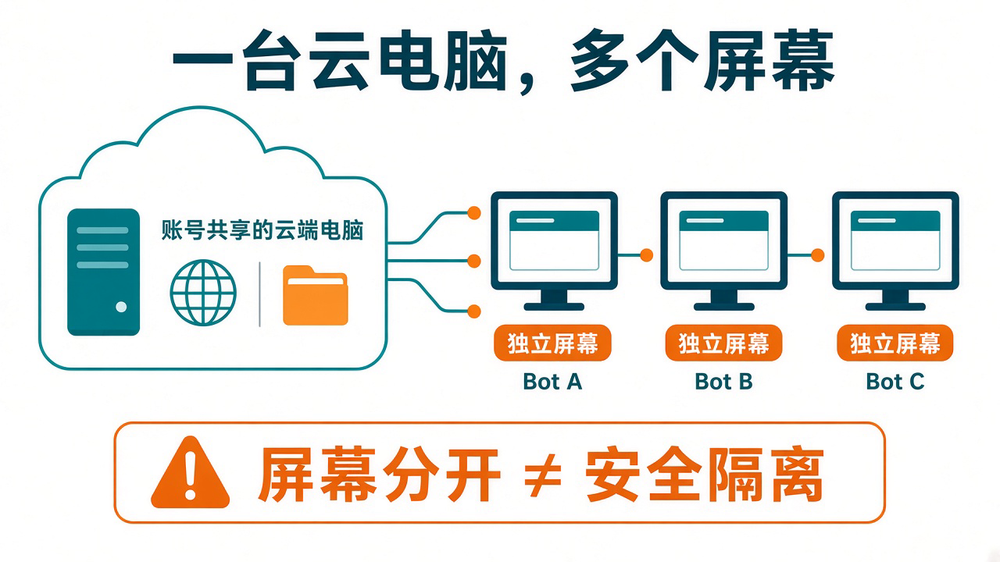

*图：账号共享一台云端电脑；每个 Bot 有独立屏幕。屏幕分开不等于安全隔离。*


入门三条硬纪律：

1. 外发、付钱、删除、正式上线——默认你点头。  
2. 先只读，再写；先草稿，再发送。  
3. 不要用「多开 Bot」代替权限设计。

### 图 2｜用交付物定义成功


*图 2：入门目标是先稳定站上 L1–L2；L3（Skill／Routine 例行化）是后面章节的事。*

| 级别 | 样子 | 说明 |
| --- | --- | --- |
| L0 | 只有讨论 | 还在聊天助手用法 |
| L1 | 交回成形的草稿／表格／纪要（对话里或文件里都算） | 开始像交作业 |
| L2 | 满足你写明的验收标准 | 可复用、可纠偏 |
| L3 | 固定流程可例行跑，异常会停下来问你 | 真正省时间区 |

### 派活单模板（可直接抄）

```text
目标：这件事要解决什么问题（一句话）
受众／用途：谁看、用在哪
交付物：要什么格式、放哪、打开后长什么样
约束：不要什么；字数／条数／语气
验收：怎样算合格（可打勾的 3 条）
权限：只读还是可写；是否允许外发／付钱（默认否）
```

**模板不是文风装饰，是把你从 L0 拽到 L2 的吊钩。**

### 本章行动

1. 用两句话复述定义（含「一台共享云电脑 + 每 Bot 一屏幕」）。  
2. 给自己当前用法标 L0–L3。  
3. 用派活单改写你最近一次「聊完没交付」的求助。

---

## 02 怎么用上

### 本章要解决什么

01 解决「它是什么」；02 解决「你坐下来之后别慌」——并给出一条 **可跟做的开箱路径**。  
完整价目与平台列表以官网／客户端为准；文中只给选型心智与操作骨架。

### 跟做小径（约 30–60 分钟）

按官方 [Get started](https://docs.x.ai/grok-bot/get-started) 与 [Computer and apps](https://docs.x.ai/grok-bot/computer-and-apps) 走通一遍。界面文案若与下文略有出入，以客户端为准。

#### 步骤 1｜官方入口与安装登录

1. 确认套餐资格（以官网／账户页为准：如 SuperGrok／Cursor 相关档位等）。  
2. 安装 Grok Bot 桌面端（macOS／Windows／Linux），用 Cursor 账号登录。  
3. 首次引导会介绍 Bot、共享云电脑与例行任务；按提示完成即可。电脑初始化在后台进行。

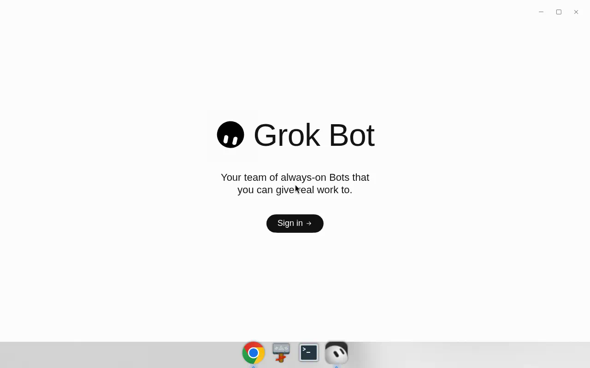

*实机：云端 Grok Bot 欢迎页「Sign in」。首次引导已跳过，无单独 onboarding 截图。*

#### 步骤 2｜创建第一个 Bot

从「Meet a future teammate」选一个建议岗，或「Create your own」，写清：

- 短名字  
- 一个主职  
- 怎么工作（含「不要做什么」）

可抄：

```text
名字：Piper
主职：产品表现排查
描述：用我授权的可观测／分析工具回答产品表现问题。保留链接与截图，区分证据与猜想，
先交最高影响问题的短摘要。绝不改生产配置。
```

聚焦岗比「全能秘书」更容易攒有用上下文。稍后可用 New → Create new agent 再加岗。

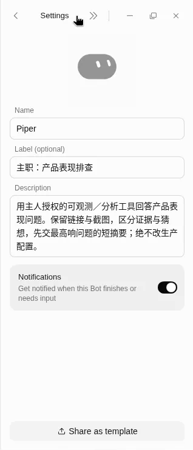

*实机：设置 Piper 的名称与职责。*

#### 步骤 3｜提供背景（最短版）

在对话里先贴一段「以后不必每次重复」的背景（完整倾倒见 03）。最少写：

```text
我是谁／时区／常用语言：
事业一句话与主要读者／客户：
本周焦点 1～3 件：
交付偏好（短、有来源、要表格…）：
禁忌（不能外发的信息、不能碰的账号、讨厌的文风）：
```

#### 步骤 4｜提交第一件任务（可抄提示词）

优先选 **无需连接器、无需网站登录** 的五分钟任务：用本书示例 [demo/项目周会纪要-示例.md](demo/项目周会纪要-示例.md)（或任意纪要），附上同一份文档，在 **Piper** 对话中发送：

```text
请把这份文档总结成 5 条要点。
另开一节列出所有日期、已做决定、未决问题；每条注明页码或小节。
不要改动源文件。
```

再试一件「进工具」的活（需登录时它会请你接管电脑）：

```text
打开我们的分析看板，对比本周与过去四周的新用户激活。
找出步骤级变化最大的一点，并起草一份简短排查计划，附相关图表链接。
不要改任何看板。需要登录时请暂停并通知我。
```

派活时也可直接套 01 的派活单六要素。

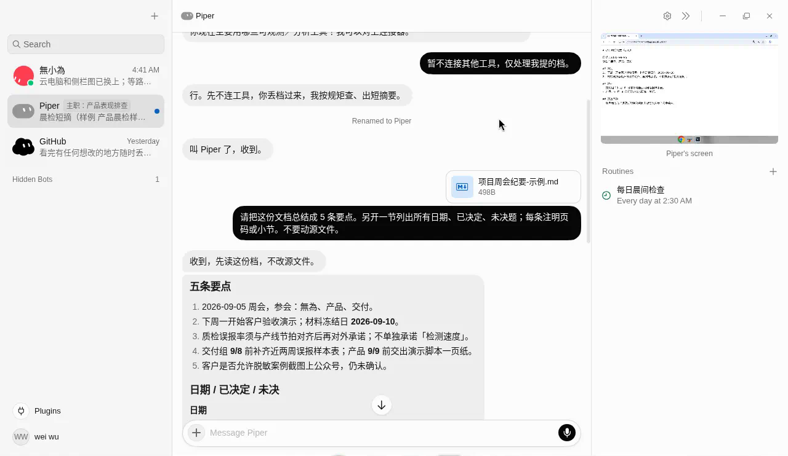

*实机：上传示例纪要后，得到要点与日期／决定／未决列表。*

#### 步骤 5｜查看结果在哪

- **对话流：** 摘要、链接、待你确认的问题通常出现在当前 Bot 对话里。  
- **Agent Computer：** 从对话打开云端电脑预览，可看点击、导航与状态；关掉笔记本不等于云端停工。  
- **共享工作区：** 重要文件约定放在 `/workspace` 下清晰项目目录，便于你与其它 Bot 接着用（仍提醒：文件对同账号 Bot 可见）。  
- **侧栏状态：** Needs attention（要你回答／审批／接管）、Unread activity（有新结果）、Working 等。

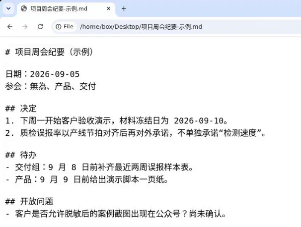

*实机：在云电脑中打开示例纪要。*

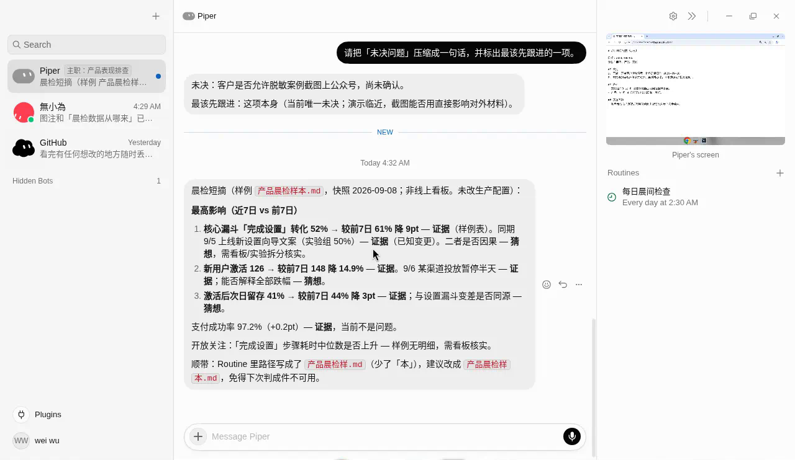

*实机：侧栏中的 Piper 与任务相关状态。*

#### 步骤 6｜修正一次

对不完整或格式不对的地方点名纠正，并把长期偏好说清楚：

```text
以后周报请用这个格式：5 条要点、来源链接内联、末节标题固定为「需要决策」。
请按此格式改一版本次结果。
```

也可先做一次轻量纠正（同文档连续演示）：

```text
请把「未决问题」再压缩成一句话，并标出最该先跟进的一项。
```


*实机：同一 Bot、同一份示例纪要上的一次修正与回复。*


流程稳定后，可再要求「把刚才的方法存成 Skill」或「做成 Routine」（见 06）——第一天不必强求。

**跟做验收：** 你能指着一份可打开的结果说「这是第一次任务」；至少做过一次格式／内容修正；知道云电脑从对话哪打开。

---

### 试用与档位：选型心智（点到为止）

| 你的情况 | 建议心智（非报价承诺） |
| --- | --- |
| 只想验证闭环 | 先用可用的试用或入门档，额度花在「倾倒 + 一件真活」，别花在养舰队 |
| 个人日常会高频派活 | 选你用得起、周期额度够跑主流程的一档；不够再升级 |
| 团队多人要用 | 看团队套餐是否席位自带 Bot 能力 |
| 已有相关订阅可关联 | 先查是否允许关联；关联≠无限额度 |

试用／首周建议锁定：① 一个闭环；② 一次合格倾倒（见 03）；③ Skill／Routine 可放到更后。  
不建议：一上来五人舰队、超长无人值守链、用模糊需求「探索性闲聊」把额度烧光。

### 例子｜同一周额度，两种花法

**花法甲：** Day1 建 6 个 Bot 寒暄；Day2 一起「研究行业」交长文；Day3 额度见底，仍无可用表。  
**花法乙：** Day1 一个 Bot + 倾倒；Day2 带派活单的真活拿到 L1/L2；Day3 同类小流程再跑一次，再考虑 Skill。  

差别通常在订单质量与编制克制，而不在「有没有挑到更贵的模型」。

### 开箱后你会看到什么

界面通常接近「消息列表」而不是「参数面板」：左侧 Bot 名单，右侧对话流；配置核心是起名、定岗、写清职责。  
桌面适合教流程、看云电脑、处理复杂授权；手机适合补派活与点审批。

### 心态：派完可走，你是审批者不是监工

中途安静，常常不是卡死，而是在共享云电脑上执行。

| 角色 | 你该做的 | 你不该做的 |
| --- | --- | --- |
| 下单者 | 把目标、约束、验收写清 | 用一句「看着办」甩锅 |
| 审批者 | 对外发／付钱／删除点头或驳回 | 每个中间点击都要围观 |
| 验收者 | 打开交付物对照派活单打勾 | 只凭「感觉写得挺好」收工 |

**派完就走 ≠ 放任越权：** 整理发票可回来抽查三行；「顺便」用你名义外发催款——必须事先授权或审批。纪律仍是：先只读、先草稿；外发默认你点头。

### 本章行动

按「跟做小径」跑完步骤 1–6；在笔记里记下：第一个 Bot 名字、第一份交付物位置、你做的那一次修正原文。

---

## 03 第一个正确动作

### 本章要解决什么

把你从「会打开」推进到「第一次交作业」。推荐顺序：

**大脑倾倒 → 反向配置 → 第一个真活。**

### 图 3｜开箱正确顺序

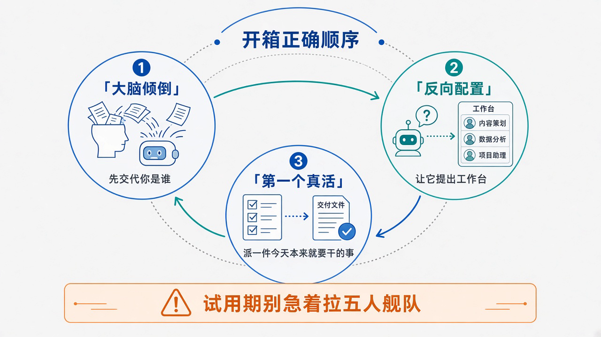

*图 3：试用期别急着拉五人舰队；先让这三步转完一圈。*

### 第一步：大脑倾倒

**目标：** 一次把「以后每次都要重复的背景」变成资产。想到什么写什么，先不必排成企业手册。

建议覆盖：

1. **身份：** 你是谁、怎么称呼、时区、常用语言  
2. **事业：** 公司／项目／个人 IP 一句话；主要客户或读者  
3. **日常：** 每周重复在做的事；最想卸掉的事  
4. **标准：** 什么样的交付算好  
5. **禁忌：** 不能外发的信息、不能碰的账号、讨厌的文风  
6. **当前焦点：** 本周真正重要的 1～3 件事  

**不用整理到完美。** 倾倒的对手是「空白」，不是「不够优雅」。常见情况：只写身份、不写标准与禁忌——后面返工会明显变多。

### 第二步：反向配置

倾倒之后，用这段提问把它变成配置助理：

```text
基于你对我的了解，如果是你，你会怎么设置这个工作台？
应该建立哪几个 Bot？它们的职位、职责和日常例行工作是什么？
请先给一版最小编制（不超过 4 个，含或不含大总管请说明理由），
每个岗写清：职责、信息源、判断标准、汇报格式。
先不要创建长链路自动化，先让我能派第一件真活。
```

你要做的是 **审**，不是全盘接受：岗是否按业务域；是否过胖（第一周：总入口 + 1 个最痛专岗往往够）；汇报格式能否打勾；有无「自动外发／自动付款」暗示——改成草稿 + 人批。删掉用不上的岗，不心疼。

### 第三步：第一个真活（三选一）

原则：**选一件今天本来就要干的小事**。套派活单。按身份选一条。

#### 选项 A｜竞品／情报监控

```text
目标：盯以下对象的公开更新，有大事才推我。
对象：（填官网／公众号／商店页）
大事定义：产品发布、明显涨价／停售、安全召回；普通软文不算。
交付物：每次不超过 3 条；每条三句话——发生了什么、为何与我有关、是否建议跟；附来源。
权限：只读公开信息；不登录我未授权的后台；不外发。
验收：格式符合；不确定标「未核实」；无大事时只回「今日无事」。
```

#### 选项 B｜发票／附件整理

```text
目标：把本周邮箱里发票类附件整理成表。
交付物：表格三列——日期、供应商、金额；另附「无法识别」清单。
权限：只读邮件与附件；不删除原信；不对外发送。
验收：抽查 3 行与原件一致；币种注明；不确定金额进「无法识别」。
```

#### 选项 C｜选题分析

```text
目标：从我最近作品数据里找可复制的选题方向。
输入：我粘贴最近 N 条标题 + 数据。
交付物：① 互动最好的 3 条共同点（各一句）② 10 个新选题 ③ 每个配一句开头钩子。
约束：受众是（填）；语气（填）；不要标题党到失实。
权限：不发布、不投稿；只交文稿。
验收：10 个选题都能一眼看出和「共同点」的关系；钩子不超过 25 字。
```

### 执行类 vs 创作类

| 类型 | 例子 | 派完后 |
| --- | --- | --- |
| 执行类 | 整理发票、只读归档、按规则扫公开页 | 可较快放手，回来验收 |
| 创作类 | 选题、文章结构、对外口径 | 先来回澄清受众与「不要什么」，再放手 |

创作类少问「读者是谁／禁用词」，常换来整页重做。多两句澄清，通常比返工更省额度。

### 第一个闭环的验收

| 你得到的 | 级别 | 下一步 |
| --- | --- | --- |
| 只有讨论、没有文件 | L0 | 补派活单，重派 |
| 交回成形的表／稿 | L1 | 对照验收条目抽查 |
| 条目基本满足你的约束 | L2 | 记入可复用做法；考虑存 Skill |
| 已能定时跑且异常会问你 | L3 | 入门后半程再追求 |

**入门毕业线：** 至少一次稳定的 L1，争取 L2。还没到 L1，不要养舰队，也不要谈无人值守。

### 本章行动

完成一次覆盖身份／标准／禁忌／焦点的倾倒；用反向配置审一版最小编制；三选一派出真活并定级 L0–L3。

---

## 04 请一个大总管

### 本章要解决什么

当你能稳定收到可打开的交付物，下一个杠杆 **不是继续加人手**，而是设一个总入口：  
**大总管（Chief of Staff / CoS）**——拆解、派发、追进度沉到水面下；你只审关键判断与审批。  
舰队可以慢慢养，**入口必须先统一**。

### 为什么第一岗往往是大总管

| 没有大总管时 | 有大总管后 |
| --- | --- |
| 你在五个对话框里当人肉路由器 | 默认只维护一个对话习惯 |
| 每个专岗都来问你「读者是谁」 | 背景与标准由总入口承继／分发 |
| 进度靠你记 | 它追进度；异常才上报 |
| 交接靠「它们自己会懂」 | 交接物可指出：文件／状态／清单 |

**一句话：** 专岗解决「会不会干」；大总管解决「你是不是总机」。

### 例子｜同一天，两种入口

你同时要：竞品有无大事、邮箱发票整理、下周选题骨架。

**入口甲：** 分别打开三个对话框，各讲一遍背景；下午三个窗口都在等你——小队越忙，你越像接线员。  
**入口乙：** 只对大总管发一张总派活单；它拆给专岗，汇总一次上报：结论、三份交付物链接、两条待你点头的问题。  

及格标准：你只回大总管；专岗对话可以存在，但不作为你的日常入口。

### 图 4｜大总管作为唯一入口


*图 4：专岗可以多，入口必须少。你维护「一个对话习惯」，不是五个。*

### 你只面对一个对话框

把下面写进大总管职责（可抄）：

```text
你是我的大总管（Chief of Staff）。
默认所有新任务先到你这里：拆解、派发给合适专岗、追踪进度、汇总上报。
我只在以下情况被打扰：需要我拍板、需要我审批（外发／付钱／删除／上线）、或你判断风险不确定。
汇报默认四段：结论／交付物／待决策／下一步。
不要让我在多个专岗对话框里当路由器。
```

审配置时盯三点：复杂活应显式交接；把「安静条件」写死；红线写进岗，不靠「性格老实」。

### 四块拼图：分工 → 通信 → 交接 → 上报

### 图 5｜四块拼图

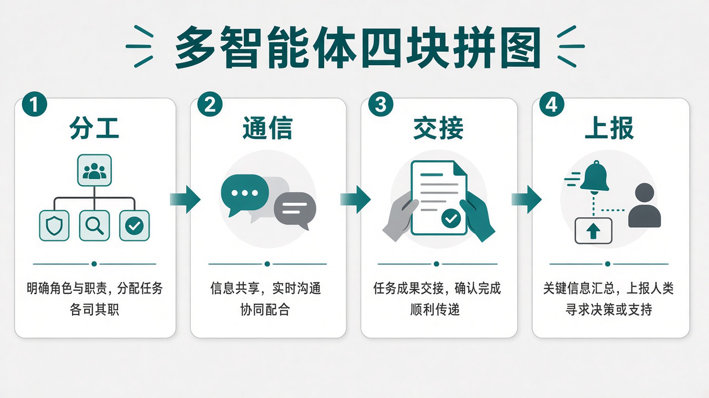

*图 5：缺交接载体，就会变成重复劳动 + 责任不清。*

| 拼图 | 要回答的问题 | 入门最低标准 |
| --- | --- | --- |
| **分工** | 谁做什么、不做什么 | 按业务域切；发现 ≠ 修复 |
| **通信** | 怎么互相反馈 | 大总管调度；专岗回执；少抄送你 |
| **交接** | 交接物是什么 | 文件／状态／清单；有载体才算交 |
| **上报** | 什么时候找你 | 结论 + 交付物 + 待决策 + 下一步 |

**发现 ≠ 修复：** 哨兵写出「现象／复现／影响面／证据」交接单 → 修复岗只凭单开工 → 大总管汇总是否要你点头上线。没有交接文件，就容易重复烧额度、说法不一致。

内容向同理：雷达发现竞品涨价 → 交接给内容岗写对比提纲 → **发布必须你点头**。雷达「顺手」发微博，是外发越权，不是效率。

### 建议的上报四格

| 格 | 写什么 | 你怎么用 |
| --- | --- | --- |
| **结论** | 一句话：现在怎样、是否要你动 | 10 秒决定看不看细节 |
| **交付物** | 可打开的文件／表格／链接 | 对照派活单抽查 |
| **待决策** | 必须你拍板的选项（尽量二选一） | 只回决策 |
| **下一步** | 它默认接着做什么；何时再找你 | 同意或叫停 |

可以这样理解：现场信息再乱，**对人接口也宜保持一个**，否则你会被平行通道淹没。

### 大总管设好后的验收

本周新任务多数先丢给大总管；上报能稳定看到四格；中间执行不再逐条直播；无「顺便外发／付款」；跨岗能指出交接文件或状态。

### 本章行动

侧栏落实一个总入口岗；用四格上报格式要求一次真实汇总；主动做一次「发现岗 ≠ 执行岗」的交接单练习。

---

## 05 按业务域招人

### 本章要解决什么

教分工，不教堆人头。编制是为了 **验收清晰、少串戏**；不是为了侧栏好看。

### 按 Lane 切，不按软件切

**Lane（业务专线）** = 一条你能说清交付物与边界的业务，例如：内容雷达、收件箱、研究侦察、支付／采购。  
**不是：** Chrome 专员、Excel 专员——工具换了岗就废，且验收写不清。

### 图 6｜按业务域 vs 按软件

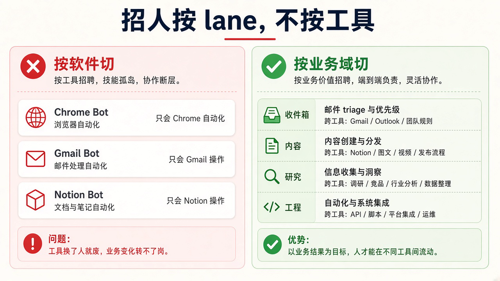

*图 6：左边是装修；右边才是编制。*

| 切法 | 典型岗名 | 后果 |
| --- | --- | --- |
| 按软件 | 「浏览器 Bot」「表格 Bot」 | 职责漂；换工具就重建；你仍要当总机 |
| 按业务域 | 「收件箱」「内容雷达」 | 验收可写；交接可指；工具只是手段 |

**判断口诀：** 把软件名从岗名里删掉，这句话还成不成岗？不成，就切错了。

### 花钱的事单独隔离

支付、订阅、采购、广告金——**单独一岗或单独流程**，不要和内容／研究／收件箱混岗。职责写死「只处理已批准的支付类任务；默认每次人批」。这与 07 一致：碰钱 = 默认你点头。

### 扩编节奏：一周一个；两周无任务先审视岗位

| 节奏 | 规则 |
| --- | --- |
| 扩 | 同一时间只认真养 +1 个新专岗 |
| 观察 | 新岗两周内至少派 3 次真活 |
| 闲置 | 连续两周没有实际任务 → 先检查是否还需要；可隐藏并暂停 Routine；确认历史成果与例行任务已妥善处理后，再考虑删除 |
| 例外 | 大总管本身不计入「可删闲岗」——但形同虚设应重写职责 |

连续两周没有实际任务，先检查是否还需要这个岗位；暂时不用可以隐藏，相关 Routine 单独暂停。确认历史成果和例行任务已妥善处理后，再考虑删除。官方说明：删除 Bot 会移除它的对话和所属 Routine，因此不要把删除当成普通的精简编制动作。

「先建着以后用」的空岗，会被误点、重复倾倒——这是注意力税，不是潜力。等某类真活连续出现，再写招募卡。

### 招募卡四件套

建岗前填满四格；**填不满 = 岗还没想清楚，先别建。**

### 图 7｜招募卡四件套

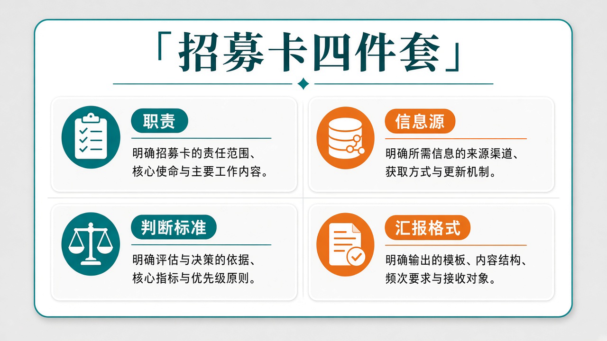

*图 7：职责 · 信息源 · 判断标准 · 汇报格式——四格缺一，后面全靠聊天补锅。*

| 件 | 要写清 | 反例 |
| --- | --- | --- |
| **职责** | 做什么／不做什么 | 「什么都能帮」 |
| **信息源** | 看哪里、输入从哪来 | 「你自己找」且无范围 |
| **判断标准** | 怎样算大事／合格／该推我 | 「重要的就说」 |
| **汇报格式** | 条数、结构、无事时回什么 | 「聊一下近况」 |

招募卡是 **岗级长期契约**；派活单是 **单次订单**。岗契约清楚，单次订单才能变短。

### 三张迷你招募卡（可直接抄）

#### 迷你卡 A｜内容雷达

```text
职责：盯指定公开源的更新；有大事才推；不写终稿、不发布。
信息源：（填列表）；不登录未授权后台。
判断标准：发布、明显涨价／停售、安全召回 = 大事；软文忽略。
汇报格式：≤3 条；每条三句话——发生了什么／为何与我有关／是否建议跟；附来源；无事回「今日无事」。
```

#### 迷你卡 B｜收件箱

```text
职责：只读分拣邮件／消息；早间简报；默认不外发、不删除原信。
信息源：我授权的邮箱；标签规则：（填）。
判断标准：紧急＝（填）；可归档＝广告／已知通知；不确定进「待你看」。
汇报格式：早间一页——紧急 N 条（标题+建议动作）／待你看 N 条／建议归档数量；不代发邮件。
```

#### 迷你卡 C｜研究侦察

```text
职责：按议题拉公开材料，整理成带来源的笔记；不下最终业务结论（除非我要求）。
信息源：我指定的关键词／站点；我粘贴的材料包。
判断标准：每条必须带来源或标「未核实」；与议题无关的不进主表。
汇报格式：材料表（标题／来源／三句摘要／相关度）+「缺口清单」。
```

工业／内容切法相同：业务域 + 四件套 + 人批红线。不必读完就觉得「必须做工厂 AI」。

### 本章行动

把侧栏里至少一个「按软件命名」的岗改成业务域名；支付类隔离或明确「暂不做」；抄改一张迷你卡并派一次真活。

---

## 06 Skill 与 Routine：示范之后怎么固化

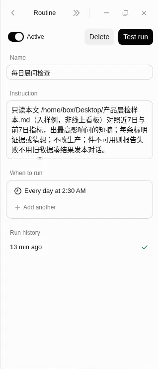

*实机：Routine 的启用开关、运行时间、测试入口与运行记录。*


### 本章要解决什么

把「每次重新解释」升级为「方法可复用、到点可自动跑」。  
官方把两块拆开（见 [Skills and routines](https://docs.x.ai/grok-bot/skills-routines-and-automations)）：

- **Skill（技能）：** 可复用的「怎么做」——步骤、判断规则、预期产出、安全边界。  
- **Routine（例行）：** 指定 **哪个 Bot、何时** 跑某套工作流——按日程，或（在支持时）按事件。

入门目标：你会把一次成功任务存成 Skill，再为它挂一条最小 Routine；不要求夜班流水线。

### 正确顺序：先会做 → 存 Skill → 再 Routine

```text
一件真活跑到可验收
    ↓
把方法存成 Skill（草稿 → 审一遍 → 安全样例测试 → 保存）
    ↓
再创建 Routine：指定拥有该例行的 Bot + 日程／事件 + 输入与审批边界
```

**口诀：** 先固化方法，再自动化触发。未稳定就 Routine，等于把噪声写进制度。

### 图 8｜从示范到 Skill／Routine

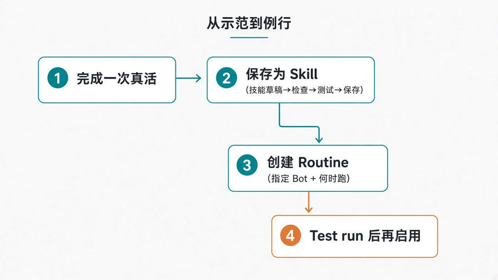

*图 8：Teach／成功任务 → Skill（怎么做）→ Routine（谁、何时跑）。纠正必须说出口；测试跑会做真实操作。*

| 阶段 | 你做什么 | 成功样子 |
| --- | --- | --- |
| 做成一次 | 带派活单跑通；写清输入／验收 | 独立重做仍可打勾 |
| 存 Skill | 请 Bot 把方法存成技能；补决策与审批边界 | `/` 菜单能引用；换 Bot 也可启用（需相应登录／连接器） |
| 挂 Routine | 指定 Bot、时区日程或事件、缺数策略 | 可 Test run；异常停问；你只抽查 |

### Skill：把「怎么做」变成资产

一次成功后，可以直接说：

```text
请把我们刚才用的流程存成名为「周度账户健康」的 Skill。
写清：源系统、风险定义、输出格式，以及「联系客户必须先审批」的规则。
```

有用的 Skill 通常包含：何时用、所需输入与权限、步骤顺序、如何校验、交回什么、哪些动作要审批。

在对话里用 `/` 引用已存 Skill；用 `@` 点名 Bot、群组、Routine、连接器。私有 Skill 可在 Settings → Plugins → Yours 里按 Bot 启用。

### Teach a task：示范会生成 Skill 草稿

当客户端提供 **Teach a task** 时，可用电脑演示浏览器流程，而不必逐步口述：

1. 打开一对一 Bot 对话及其电脑视图；  
2. 选择 Teach a task；  
3. 先描述你要演示的结果；  
4. 完整做一遍（可见交互，最长约十分钟量级；不录麦克风）；  
5. 停止录制，**审阅 Bot 生成的 Skill 草稿**；  
6. 用安全样例测试后再谈日程化。

演示时避免暴露密钥；登录／验证码走接管或安全录入。  
草稿往往缺「失败怎么处理、何时必须人批」——这些要用文字补上。若看不到 Teach 入口，可改为：基于刚才完成的任务与文字说明，请 Bot 起草 Skill。

### Routine：指定谁、何时跑

Skill 解决「会不会」；Routine 解决「自动不自动」。对 **拥有该例行任务的那个 Bot** 说：

```text
每个工作日上午 8:00（我的时区），对当前客户列表运行「日客风险」Skill。
在本对话发布带链接的观察名单。不要联系客户。
若源数据不可用，报告失败，不要用旧数据凑数。
```

创建前确认：拥有 Bot、日程与时区、输入来源、预期结果、审批边界、缺数／过期策略。  
后台 Routine 可在笔记本关闭时继续跑。事件触发（如 Slack／GitHub 通知类账户集成）请写窄匹配规则，避免「监听每一个新消息」。

**Test run 会做真实工作**（可改文件、调连接器、逛网站）。用安全输入，写操作仍放在审批后。测完再 Enable。

#### 例子｜Piper「每日晨间检查」的数据从哪来

第 02 章连续演示里，Piper 的第一件活吃的是会议纪要；晨检 Routine 则应读 **产品数据**，别假装纪要等于看板。入门可先用本地样本：

- 样例文件：[demo/产品晨检样本.md](demo/产品晨检样本.md)（指标表 + 已知变更；非线上数据）  
- Routine 说明里写清：只读该文件（或你指定的看板链接／已授权连接器）；区分证据与猜想；不改生产配置；缺数就报告失败，不用旧数凑。  
- 接上真实分析工具后，把输入来源从样例文件改成看板或连接器即可，岗职责不用推倒重来。

创建或修改后先 **Test run**，确认对话里出现可验收摘要、Run history 有记录，再打开 Active 做定时运行。

可在 Bot 的 View conversation details → Routines 里启用／暂停、测试、改说明、看最近运行（产品对 Routine 数量与运行记录有上限，以客户端为准）。长期离开时，产品可能询问是否继续跑例行任务——回来时检查是否被暂停。

### 适合／不适合硬固化

### 图 9｜适合与不适合例行化

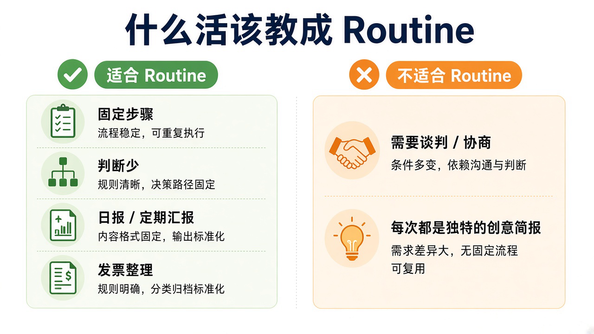

*图 9：步骤固定、判断少 → 适合进 Skill／Routine；临场博弈、每次方案不同 → 先别固化。*

| 适合 | 不适合硬套 |
| --- | --- |
| 每周发票 → 三列表格 | 临场谈判／报价博弈 |
| 公开页巡检 → 固定简报 | 每次受众不同的方案写作 |
| 收件箱只读分拣 → 早间摘要 | 需你现场拍板的策略取舍 |
| 下载→命名→归档 | 高风险外发／支付主链路（最多做到「交待审草稿」） |

创作类通常只固化前端固定步；口径与终稿仍走人审。

### 教学前四问

有一问答不上，就还不宜挂 Routine：

1. **输入稳定吗？** 每次从哪来、缺了怎么办？  
2. **步骤能数出来吗？** 最好 ≤5 步；超过就先拆。  
3. **判断少吗？** 规则能写成「如果…则…」；不能则留人工。  
4. **失败可见吗？** 怎样算跑偏？异常默认停问，不要静默跳过。

### 例子｜发票整理：从成功到 Skill 再到 Routine

- 输入：本周邮箱「发票」标签；缺附件进「无法识别」。  
- 步骤：打开邮箱 → 筛标签 → 下载附件 → 填三列表 → 交表。  
- 判断：金额看不清 → 不猜。  
- 失败：抽查 3 行不一致 → 整表退回并指出规则错在哪。  

四问通过且独立重做两次可打勾 → 存 Skill「周发票三列表」→ 再挂「每周一 9:00 由收件箱岗运行」的 Routine；Test run 用过期周数据试一次。

### 纠正用嘴说，别默默自己返工

说出口：「第 3 步币种没标，以后默认在金额旁注明；错的三行我标了。」——下次默认改掉。  
只自己改表交差，它会以为原样就对；只发「重做」不说哪错，可能换一种错法。  
宁可多打几句纠偏，也比下周五次隐形编辑更划算——并把纠偏写进 Skill。

### 本章行动

1. 选一件已跑到 L2 的固定活，四问自检。  
2. 存成 Skill（或 Teach 后审草稿 + 测试）。  
3. 再挂一条最小 Routine，完成一次 Test run；确认异常会停问。

---

## 07 什么时候必须你点头

### 本章要解决什么

建立审批与安全心智：  
**放手执行 ≠ 放任越权；多 Bot ≠ 多隔离。**  
并把两件常被混为一谈的事分开讲。

### 两层闸门：请求里的边界 ≠ 产品 Auto Review

| 层 | 是什么 | 你怎么用 |
| --- | --- | --- |
| **A. 请求里的审批边界（作者强烈建议写进派活单／Skill）** | 你用文字规定：可做什么、必须停在哪 | 每条高风险任务显式写「先草稿／先请示」 |
| **B. 产品 Auto Review（客户端机制）** | Settings → General → Auto-review 中的规则；匹配时弹出审批卡（Allow once／Deny／Always allow 等） | 用窄规则补强；不替代 A；也不等于「点过一次就永远安全」 |

官方说明见 [Approvals, security, and privacy](https://docs.x.ai/grok-bot/approvals-security-and-privacy)：Auto Review 会在工具调用与电脑动作执行前评估；Require Approval 优先于 Always Allow；规则存于当前桌面并同步到其 Grok Bot 电脑——换另一台桌面安装请重新核对。

**可以这样理解：** A 是你给同事的任务说明书；B 是系统在危险动作上再拦一道。只靠 B、请求里含糊，仍容易在「它以为你允许」处翻车；只写 A、从不看审批卡，也会误批。

### 在请求里写边界（层 A）

优先对下列动作写死「先请示」：外发消息／邀请、发布内容、采购与转账、删除或覆盖数据、改权限、改生产、接受法律条款。

可抄：

```text
请核对活动数据并起草预算调整建议。
不要改活动设置，也不要联系代理商。
展示完当前值、建议值与预期影响后，再向我申请批准。
```

审批管的是 **拟议动作**；已经做完的中间步骤不会因为你点 Deny 而自动倒带。

### Auto Review 与三类高风险（层 B + 实践分类）

### 图 10｜三类你该特别盯的点

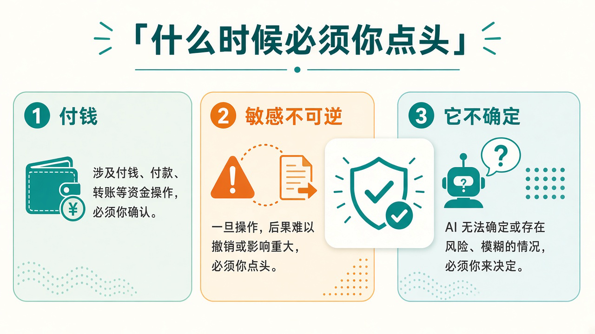

*图 10：付钱 · 敏感不可逆 · 它不确定——闸门设在这些点；中间执行别围观。产品 Auto Review 规则与「派活单红线」要一起用。*

| 类 | 典型动作 | 你的默认姿势 |
| --- | --- | --- |
| **① 付钱** | 支付、订阅、采购、充值 | 先看清金额与对象；确认再批 |
| **② 敏感不可逆** | 外发邮件／社媒、删除、正式发布／上线 | 先只读、先草稿；红线写进派活单与 Skill |
| **③ 它不确定** | 指令含糊、权限不足、自评风险高 | 宁可多问；禁止「默默赌一把」 |

配置 Auto Review 时写 **窄规则**，例如：「外发邮件前必须审批」「改生产看板前必须审批」「允许在 `/workspace/reports` 跑 `git status`」。避免「浏览器里什么都允许」这类宽规则。

### 两个错误姿势

| 姿势 | 样子 | 代价 |
| --- | --- | --- |
| **什么都审** | 每个中间点击都要你围观 | 你变回监工；小队无意义 |
| **什么都不看** | 审批卡一律快点通过 | 出事时答不出授权与点过什么 |

**正确姿势：** 闸门设在钱／外发／删除／上线／你划的红线；中间执行派完可走，回来验收交付物。

### 例子｜同一封催款邮件

- 什么都审：逐步汇报粘贴过程——你不如自己发。  
- 什么都不看：允许直接发送且不看对象——这是事故。  
- 正确：它交 **待审草稿**（收件人、金额、附件列表）；你点头后才发；发送回执进上报。派活单写清层 A；若弹出 Auto Review 卡（层 B），再核对目标与范围。

### Bot 不是安全边界

### 图 11｜人话版安全边界

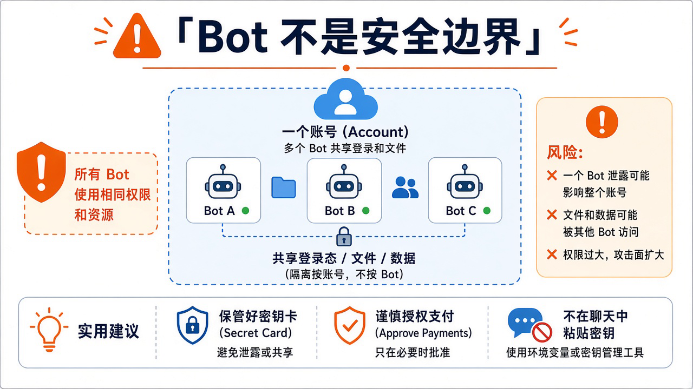

*图 11：隔离按账号与授权；不按「看起来老实的 Bot 个数」。屏幕不是安全边界。*

| 你可能以为 | 更接近现实 |
| --- | --- |
| 5 个 Bot = 5 个隔离员工 | 同账号共用一台云电脑；登录态与文件共享 |
| 那个岗比较老实就不会动钱 | 支付／外发／删除应走审批，不靠人设 |
| Key 贴进聊天最省事 | 密钥走安全录入／接管电脑；聊天不是保险柜 |
| 多开 Bot = 权限设计 | 出事要答得出：授权了什么、点过什么、标准是什么 |

密码、二次验证、CAPTCHA、支付确认：打开 Agent Computer，你来接管完成，再交还。公开分享 Bot 配置 ≠ 分享你的电脑与登录——但仍勿把密钥写进可分享人设。

### 实践底线（入门写死）

1. 外发、付钱、删除、正式上线——默认你点头（层 A 写进订单；层 B 用 Auto Review 补强）。  
2. 先只读，再写；先草稿，再发送。  
3. 不要用多开 Bot 代替权限与账号隔离。  
4. 密钥／令牌走安全录入，不进普通对话。  
5. 花钱的事单独隔离（呼应 05）。  
6. 本地电脑执行是另一项能力：Settings 里默认「每次询问」；无必要保持从不允许。

### 本章行动

默写「层 A / 层 B」各一句；在派活单模板里固化权限行；打开 Settings → Auto-review，加一条与你业务相关的窄规则（或确认暂时只用请求边界）。

---

## 08 抄三条能交作业的玩法

### 本章要解决什么

前面几章把心智搭好了。08 不堆酷用法，只给 **三条通用、可抄、能交作业** 的玩法。每条同一骨架：

**效果一句话 → 派活提示词 → 验收 → 边界**

抄结构，不抄你的行业细节。跑通 L2 比收藏一百个案例更值钱。

### 图 12｜三条能交作业的玩法

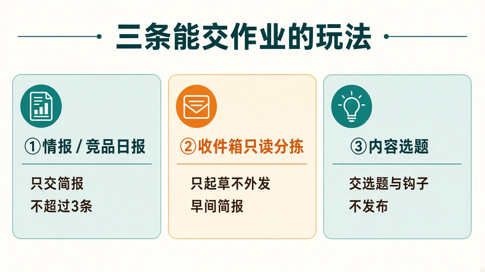

*图 12：哨兵型／简报型／创作型——三条够用；先求可验收，再谈花样。*

### 图 13｜玩法卡片解剖

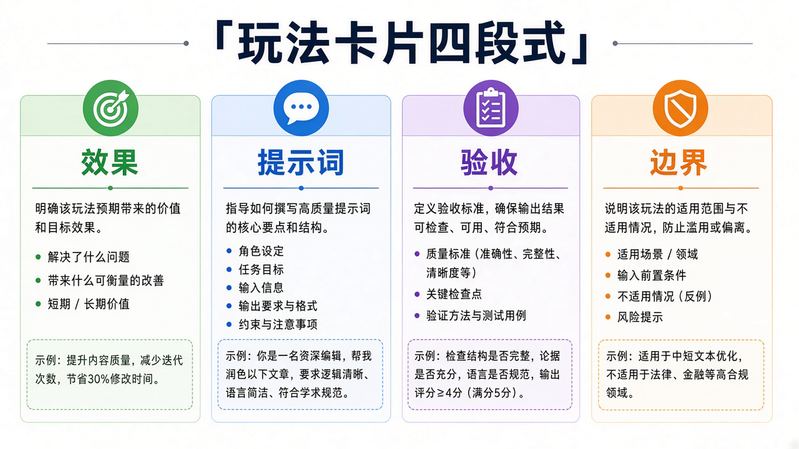

*图 13：若你写不出验收与边界，这件事还不宜派——先缩成只读整理。*

派活时继续用 01 的六要素模板。下面三条都是填满后的样子。

---

### 玩法 1｜情报／竞品日报（哨兵型）

**效果一句话**  
每天打开就能扫完「该不该跟」的大事；无事则安静。

**派活提示词（可抄）**

```text
目标：盯以下对象的公开更新，有大事才推我。
对象：（填官网／商店页／公开博客／公开社媒账号）
大事定义：产品发布、明显涨价／停售、安全召回、重大合作官宣；
普通软文、招聘广告、日常鸡汤不算。
交付物：每次不超过 3 条；每条三句话——
  1）发生了什么  2）为何与我有关  3）是否建议跟（跟／不跟／待核实）
  附来源链接或原文标题。
权限：只读公开信息；不登录未授权后台；不外发；不代发评论。
验收：格式符合；不确定标「未核实」；无大事时只回「今日无事」。
安静日也要回「今日无事」，不要消失。
```

**验收打勾：** 三句话 + 来源；软文被挡在门外；安静日明确回执；只读公开源。  
交回成形的简报＝L1；过滤与格式都满足＝L2；能挂 Routine 且异常会问你＝L3。

**边界：** 不做内网情报、不破解付费墙；不代发帖；不把「未核实」写成确定结论。

**例子：** 「帮我盯一下行业」没有对象与大事定义 → 易交来万字综述。对象与定义写死 → 你只审「算不算大事」。安静日也守规矩，才叫省注意力。

---

### 玩法 2｜收件箱只读分拣 + 早间简报（简报型）

**效果一句话**  
早上打开「待处理／可归档／待你拍板」清单，而不是自己当人肉分类器。  
关键约束：**只读分拣，不外发。**

**派活提示词（可抄）**

```text
目标：对今日收件箱做只读分拣，并生成早间简报。
信息源：（填已授权邮箱／消息入口）
分类：A 待我处理｜B 可归档｜C 待核实
交付物：
  1）早间简报：A 类最多 7 条，每条一行——发件人｜主题｜为何重要｜建议动作
  2）B／C 类各给计数 + 3 个代表例
  3）「疑似垃圾／营销」单独计数，不要展开正文
权限：只读；不删除原信；不自动回复；不转发；不改标签（除非我书面允许）。
验收：A 类每条能看出「我为什么要看」；抽查 3 封分类不离谱；不确定进 C。
```

**边界：** 默认禁止外发／回复／删除。要回信：只交草稿，你点头后再发。支付、改密、授权新设备类邮件——标出来等人。简报是分拣，不是结案。

**例子：** 「能回的回一下」缺权限行 → 可能用你口吻承诺未答应的交期。改法：权限写死「只读；回复只交草稿」。

---

### 玩法 3｜内容选题（创作型）

**效果一句话**  
从已有作品／笔记抽出可复制方向 + 带钩子的新选题——先不发布。  
记住：创作类先澄清读者，再放手。

**派活提示词（可抄）**

```text
目标：从我最近作品／笔记里找可复制的选题方向。
输入：我粘贴最近 N 条标题 + 数据（或笔记要点）。
受众：（填：谁看、在什么场景打开）
交付物：
  ① 互动／复用最好的 3 条共同点（各一句）
  ② 10 个新选题（每个能一眼看出和共同点的关系）
  ③ 每个选题配一句开头钩子（≤25 字）
约束：语气（填）；不要标题党到失实；不要虚构数据。
权限：不发布、不投稿、不改已发布内容；只交文稿。
验收：10 个选题都能指回共同点；钩子≤25 字；至少 2 个标「需补事实后再写」。
```

**边界：** 先选题后成稿；涉及收益承诺、医疗、法律结论的选题标红人审。少问读者两句，常换来整页重做——来回澄清是验收前置，不是矫情。

---

### ［可选］企业资料／质检资料只读整理

```text
目标：只读整理本批次质检／检验资料为台账。
交付物：表格（批次号、日期、检验项、结果、来源文件名）+「缺字段／无法识别」清单。
权限：只读指定文件夹；不改原件；不外发；不对接产线控制系统。
验收：抽查 3 行与原件一致；不确定进「无法识别」；禁止编造合格结论。
```

不代替合规签字；不自动判定「可出货」。结构可抄，结果别承诺。

### 怎么选（一分钟）

| 你这周最烦的事 | 先抄哪条 | 毕业线 |
| --- | --- | --- |
| 生怕错过公开更新 | 玩法 1 | 连续 3 天格式稳定，含安静日 |
| 收件箱淹没注意力 | 玩法 2 | 早间简报可抽查，且零外发事故 |
| 选题从零很痛 | 玩法 3 | 10 选题可指回共同点 |
| 资料散在文件夹 | 可选只读台账 | 抽查 3 行一致 + 缺字段清单 |

**不要** 三条一起上。选一条跑到 L2，再加第二条。稳定后可按 06 存 Skill／挂 Routine。

### 本章行动

抄通一条玩法；对照派活单六要素齐全；收件箱类权限写死只读。

---

## 09 额度与坑

### 本章要解决什么

少翻车、少空转额度。  
价格、试用、周期用量、超量规则以官网／客户端为准。本章只教心智。

### 计费心智（点到为止）

| 心智块 | 人话 | 你要做的 |
| --- | --- | --- |
| 订阅档位 | 买的是周期内可用能力包，不是无限员工 | 打开客户端看当前档与权益 |
| 周期用量 | 许多产品面按周期重置；不同动作耗用不同 | 在用量页看百分比与重置时间 |
| 超量／按量 | 用尽后可能暂停或进入按量 | 先决定：等重置，还是明确打开按量 |
| Bot 与纯聊天 | 是否共用额度以官方说明为准 | 别用「聊天还剩很多」推断 Bot |

### 模型选用：没有「贵／便宜模型」挑拣器

官方在设置说明里写明：**Cursor 管理模型选用，客户端没有模型选择器。**  
（见 [Settings and notifications](https://docs.x.ai/grok-bot/settings-and-notifications)。）

因此本文 **不** 教你「给杂活 Bot 选便宜模型、给难活选贵模型」。所谓「任务分层」，指的是 **工作负载设计**：

| 层 | 适合放什么 | 目的 |
| --- | --- | --- |
| Skill + Routine | 步骤固定、已验收的重复活 | 少重复解释、少空转对话 |
| 业务专岗（Lane Bot） | 同一领域的持续上下文与验收口径 | 少串戏、少五岗重复倾倒 |
| 大总管（CoS） | 拆解、派发、追进度、汇总 | 你不当人肉路由器 |
| 你本人 | 拍板、高风险审批、口径终稿 | 闸门留在人 |

### 图 14｜六个吞金兽

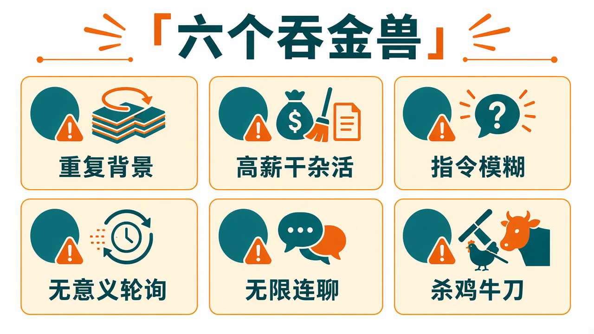

*图 14：额度通常不是「没挑到贵模型」，而是订单糊、编制肥、轮询空转。*

| # | 吞金兽 | 典型样子 | 改法 |
| --- | --- | --- | --- |
| 1 | 重复背景 | 五个岗各讲一遍「我是谁」 | 一次倾倒；新岗只补增量 |
| 2 | 专岗干纯重复杂活 | 每次完整长指令搬文件／改名 | 做成 Skill／Routine，触发语缩短 |
| 3 | 指令模糊 | 「研究一下」无验收 | 派活单六要素 |
| 4 | 无意义轮询 | 每分钟问「点到哪了」 | 派完就走；卡审批再回来 |
| 5 | 无限连聊 | 创作类不澄清就改到见底 | 先澄清读者与禁忌再放手 |
| 6 | 杀鸡用牛刀 | 归档小事拉五人舰队 | 一件真活一个岗；编制是结果 |

### 例子｜同一周额度，两种死法

**死法甲：** 六岗寒暄 + 三人同时「研究行业」→ 额度见底无可用表（吞金兽 1+3+6）。  
**活法乙：** 倾倒 + 一条哨兵或收件箱简报到 L2 → 再存 Skill。差别在订单与编制克制。

### 图 15｜工作负载分层（非模型档位）

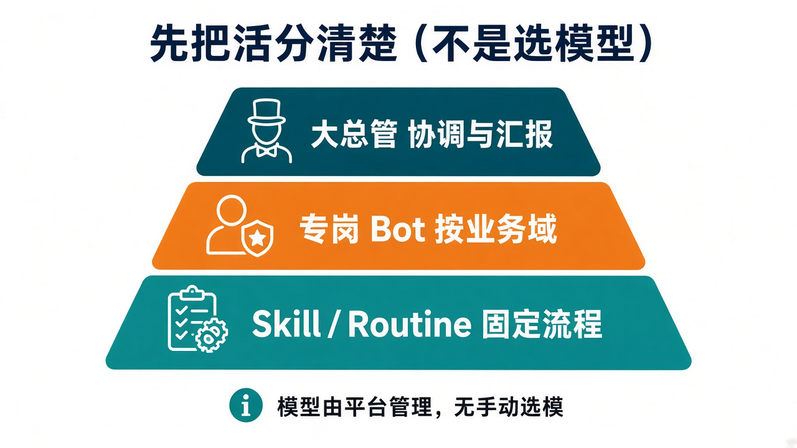

*图 15：Skill／Routine 吃重复步骤 · 专岗吃领域上下文 · 大总管吃协调 · 你吃判断与审批。这是负载设计，不是「自选模型价位」。*

### 四条省用量

1. **按上表分层负载**——能 Skill／Routine 的不要每次从零聊。  
2. **同类活做熟再固化**——见 06；Test run 用安全输入。  
3. **验收前置**——写不出「怎样算不合格」就先只读整理。  
4. **盯重置节奏**——大活落在额度充裕段；临近清零别开探索闲聊。

若客户端提供按量／自动充值：先查看是否可设上限；打开前先分清是「主流程不够」还是「订单太糊在空转」——后者加钱解决不了。

### 硬限制速览（易变）

| 限制感 | 人话预期 | 实践建议 |
| --- | --- | --- |
| 远程／本地连接 | 云端 Bot 够得着的是可达远程与已提供连接器；本机 localhost 往往够不着 | 别假设「IDE 里能连＝Bot 也能连」 |
| 写码／重工程 | 长程改仓库常见路径是配套云端编程代理，而非办公 Bot 硬扛全过程 | 派活写清交付形态 |
| Update／Reset Computer | 更新常保留持久状态；未持久环境可能丢 | 重要结果放 `/workspace`；变更后先冒烟 |
| 共享电脑 | 同账号多 Bot 共享文件与登录态 | 密钥走安全录入；多开 Bot ≠ 隔离 |

### 本章行动

对照六个吞金兽自查本周；画出你的「Routine／专岗／大总管／你」负载图；确认自己没有在找「模型价位开关」。

---

## 10 下一步

### 本章要解决什么

收束。读完不等于会用；**本周只做三件事**，把闭环钉在日历上。

### 图 16｜本周只做三件事

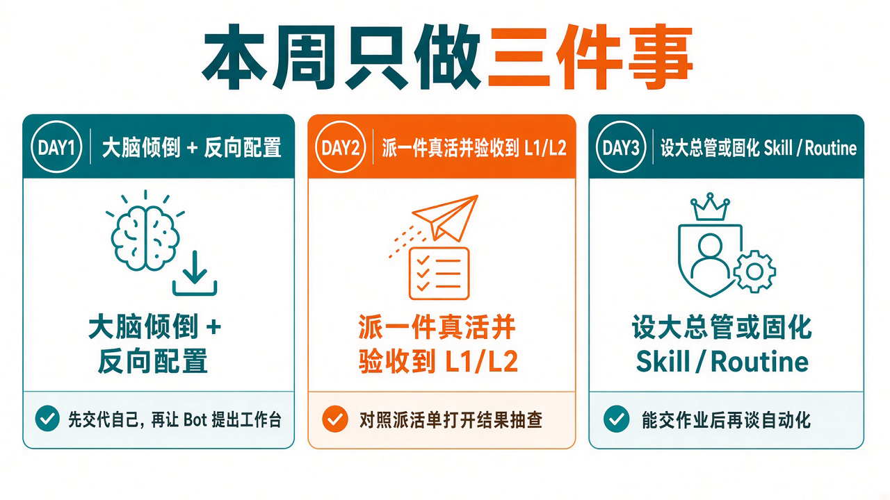

*图 16：别同时开舰队装修；先把闭环钉牢——倾倒配置 → 一个真活 → 大总管或一条 Skill／Routine。*

### 本周只做三件事

| # | 事 | 完成样子 | 不要顺手做的 |
| --- | --- | --- | --- |
| 1 | 倾倒 + 反向配置 | 身份／标准／禁忌／焦点已灌；侧栏最小编制审过（建议 ≤4） | 一上来建五人舰队 |
| 2 | 派一个真活闭环 | 带派活单；交回成形的东西；抽查定级 L1/L2 | 同时开三条玩法 |
| 3 | 设大总管 **或** 存一条 Skill（可再挂最小 Routine） | 二选一完成 | 又扩两个专岗「先占坑」 |

**毕业线自检：** 交回成形的东西（L1）；对照验收能打勾（L2）；说得出四类默认要你点头的事（外发、付钱、删除／不可逆、正式发布／上线）。还没到 L1：先别扩编，也先别谈无人值守。

不及格：侧栏热闹、文件夹没有新文件。及格：你能指着一个文件说「这是本周那条简报／日报／选题表」，且无外发事故。**交付物说话，热闹不说话。**

### 公众号连载（示意）

| 篇 | 方向 | 章节 |
| --- | --- | --- |
| 1 | 它不是聊天框 | 00 + 01 |
| 2 | 开箱跟做 | 02 + 03 |
| 3 | 先请一个大总管 | 04 |
| 4 | 按业务域招人 | 05 |
| 5 | Skill 与 Routine | 06 |
| 6 | 什么时候必须你点头 | 07 |
| 7 | 三条能交作业的玩法 | 08 |
| 8 | 额度、坑与下一步 | 09 + 10 |

篇目与排期以作者后续发布为准；本仓库正文优先。

### 版本说明

| 项 | 内容 |
| --- | --- |
| 文档版本 | **v1.0.0** |
| 口径 | 机制描述建立心智；与客户端不一致时以客户端为准 |
| 案例 | 结构可抄，非投资／成交／收益承诺 |
| 欢迎纠正 | 发现过时菜单、错误限制描述，请告知作者 |

### 本章行动

在日历写下三个时间块（倾倒／真活／大总管或 Skill）；真活选定 08 三条之一。

---

## 附录 A 术语：一句人话

| 词 | 一句人话 |
| --- | --- |
| Bot | 云端数字同事：在共享云电脑的独立屏幕上执行任务的 AI 岗 |
| 共享云电脑／Agent Computer | 账号级一台持久电脑；文件与登录态共享；每 Bot 一屏幕，屏幕不是安全边界 |
| 大总管／CoS | 管其他 Bot 的总入口；你只维护一个对话习惯 |
| Lane | 一条业务专线（收件箱、内容、研究…） |
| Skill | 可复用的「怎么做」（步骤、规则、产出、审批边界） |
| Routine | 指定哪个 Bot、何时跑某套工作流（日程或事件） |
| Teach a task | 用电脑示范生成 Skill 草稿，需审阅与测试 |
| Auto Review | 产品侧规则：匹配的工具／电脑动作执行前可弹审批卡 |
| 请求边界 | 你在派活单／Skill 里写死的「可做／必须停」——与 Auto Review 互补 |
| 大脑倾倒 | 一次性把背景、标准、禁忌灌给 Bot |
| 派活单 | 目标／交付物／约束／验收／权限的订单骨架 |
| L0–L3 | 讨论→交回成形的东西→满足验收→可例行且异常会问你 |
| 连接器／Plugins | 结构化应用接口；可用时往往比纯点网页更稳 |
| 工作负载分层 | 用 Skill／Routine、专岗、大总管、你本人分工——不是自选模型价位 |

---

## 附录 B 常见问题

### 1. 和直接用 Grok 聊有何不同？

聊天助手的主战场是对话框。Grok Bot 的主战场是共享云端电脑与你授权的应用：你派活，它去点、填、整理、起草，交回可打开的结果，必要时停下来让你审批。可以同时用两者，但预期不能混。入门瓶颈通常不在「哪个模型更强」，而在背景、验收、权限有没有写进订单。

### 2. 一定要付费吗？

以官网／客户端当前档位与试用说明为准。入门建议把额度花在「倾倒 + 一件真活」，而不是养舰队。本文不报价。

### 3. 会控制我的电脑吗？

Bot 默认在 **云端电脑** 上工作；你的笔记本关掉，云端活往往还能继续（仍受授权与审批约束）。只有在你明确开启并批准「在本地电脑执行」时，它才可能动你面前的机器。敏感步骤可接管云端电脑；密码走安全录入而不是贴进聊天。

### 4. 手机关机它还干吗？

手机／桌面主要是指挥与审批入口。云端任务可以在你离开后继续跑；卡在登录、支付、不确定时会停下来等你。「关机」不等于「全停」，「安静」也不等于「死机」——但外发与付钱仍不该在你不知情时发生。

### 5. 一个人养几个合适？

入门：一个闭环岗，或「大总管 + 一个最痛专岗」。扩编建议一周最多加一个。连续两周没有实际任务，先检查是否还需要这个岗位；暂时不用可以隐藏，相关 Routine 单独暂停。确认历史成果和例行任务已妥善处理后，再考虑删除（删除会移除对话与所属 Routine）。编制是结果不是装修。先稳定 L1/L2，再谈舰队；重复方法先 Skill，再 Routine。

### 6. 每个 Bot 是不是一台独立电脑？

不是。官方口径是：账号共用一台云电脑；每个 Bot 有自己的屏幕以便并行操作。屏幕不是安全边界——不要用「多开 Bot」当隔离。

---

## 附录 C 来源分层与免责

### 信息怎么分层读

| 层级 | 是什么 | 你怎么用 |
| --- | --- | --- |
| 官方 | 产品官网、官方文档、客户端内说明 | 价格、平台、菜单、权益以它为准；与本文冲突时听官方 |
| 社区 | 公开讨论、实测笔记 | 建立「常见坑」直觉；当作易变经验 |
| 作者整理 | 章节结构、例子、派活单模板 | 可抄结构与验收方式；非官方文档 |

### 免责

1. **产品迭代快。** 按钮文案、套餐、限制细节可能已变更；以当前客户端与官网为准。  
2. **本文不是官方文档**，不构成投资、成交、收益或合规承诺。例子是结构示范。  
3. **安全与合规责任在你。** 外发、付钱、删除、正式上线默认人批；强监管场景走你自己的合规流程。  
4. **Bot 不是安全边界。** 同账号共享云电脑；隔离首先是账号与权限设计。

---

## 参考链接

以下为撰写 v1.0.0 时对照的官方文档（英文原文；产品若改版以线上为准）：

| 主题 | URL |
| --- | --- |
| Grok Bot 文档入口 | https://docs.x.ai/grok-bot |
| 快速开始 | https://docs.x.ai/grok-bot/get-started |
| 云电脑与应用 | https://docs.x.ai/grok-bot/computer-and-apps |
| Skill、Routine 与自动化 | https://docs.x.ai/grok-bot/skills-routines-and-automations |
| 设置与通知（含「无模型选择器」） | https://docs.x.ai/grok-bot/settings-and-notifications |
| 审批、安全与隐私（含 Auto Review） | https://docs.x.ai/grok-bot/approvals-security-and-privacy |

---

*v1.0.0 · 完*
